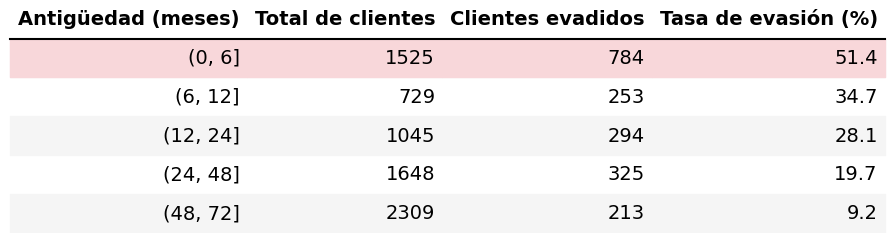

# 📊 Análisis de Churn en Clientes de Telecomunicaciones

Este proyecto presenta un análisis exploratorio y descriptivo del **churn de clientes** en una empresa de telecomunicaciones, con el objetivo de identificar los factores más relevantes asociados a la evasión del servicio y proponer recomendaciones estratégicas orientadas a la retención.

---

## 🎯 Objetivo del proyecto

Analizar el comportamiento de evasión de clientes (*churn*) a partir de variables categóricas y numéricas, evaluando su impacto tanto en la pérdida de clientes como en los ingresos, y generando insights accionables para la toma de decisiones.

---

## 📁 Estructura del repositorio

📦 churn-analysis-telecom  
├── data/          # Dataset original  
├── notebooks/     # Notebook principal de análisis  
├── assets/        # Gráficos y tablas exportadas como imágenes  
├── README.md  
└── requirements.txt

---

## 📊 Variables analizadas

### 🔹 Variables categóricas
- Tipo de contrato
- Método de pago
- Servicio de internet
- Facturación sin papel

### 🔹 Variables numéricas
- Antigüedad del cliente (*tenure*)
- Cargos mensuales (*monthly charges*)
- Cargos totales (*total charges*)

---

## 📈 Principales hallazgos

- La evasión se concentra en **contratos mensuales**, mientras que los contratos de largo plazo presentan mayor retención.
- Los clientes que pagan mediante **cheque electrónico** muestran una tasa de churn significativamente mayor.
- El **servicio de fibra óptica**, aunque tecnológicamente superior, presenta mayores niveles de evasión, sugiriendo posibles brechas entre precio y experiencia percibida.
- Clientes con **menor antigüedad** y **cargos mensuales elevados** presentan una mayor probabilidad de evasión.
- Aunque los clientes que abandonan representan una menor proporción del total, generan una **pérdida considerable de ingresos acumulados**.

---

## 🖼️ Visualizaciones

Todas las gráficas y tablas finales utilizadas en el informe se encuentran disponibles en la carpeta [`assets/`](./assets), exportadas como imágenes para facilitar su reutilización en presentaciones y reportes.

Ejemplo:

---

## 🛠️ Herramientas utilizadas

- Python
- Pandas
- Matplotlib
- Seaborn
- Jupyter Notebook

---

## 📌 Conclusiones y recomendaciones

- Priorizar estrategias de retención durante los **primeros meses del cliente**.
- Incentivar la migración hacia **métodos de pago automáticos**.
- Revisar la propuesta de valor del servicio de **fibra óptica**, alineando precio, soporte y calidad percibida.
- Implementar modelos predictivos futuros para anticipar el churn y actuar de forma preventiva.

---

## 👤 Autor

**Juan Esteban Rodríguez Aranda**  
Ingeniería Ambiental | Data Analysis | Web developer 
📍 Colombia
